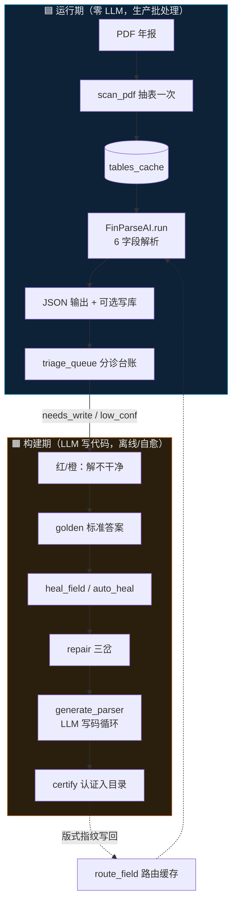

# 鸟瞰：运行期 vs 构建期

系统本质是**两条线、一个闭环**：

- **运行期**：零 LLM，跑冻结的确定性 Python
- **构建期**：LLM 写专用解析器，`exact` 闸门验收后入库
- **闭环**：认证后写回路由缓存，下次同版式自动 `routed`

**相关代码**：`src/batch_runner.py` · `src/engine_orchestrator.py` · `src/agents/heal_pipeline.py`
