# 图 1：一份报告怎么跑（运行期主流程）

入口：`batch_runner.run_batch` 或 `FinParseAI().run(pdf)`

```mermaid
flowchart TD
    START([开始: 一份 PDF]) --> A{有 tables_cache?}
    A -->|否| B[scan_pdf 抽全表<br/>table_scanner.py]
    A -->|是| C[直接用缓存表]
    B --> D[(cache_put → tables_cache)]
    C --> D

    D --> E[FinParseAI.run<br/>engine_orchestrator.py]

    E --> F1[字段1: 营收]
    E --> F2[字段2: 成本]
    E --> F3[字段3: 研发]
    E --> F4[字段4: 员工]
    E --> F5[字段5: 客户]
    E --> F6[字段6: 供应商]

    F1 & F2 & F3 & F4 & F5 & F6 --> G{每字段:<br/>先路由后冷启动}

    G -->|命中| H[专用解析器结果<br/>source=routed]
    G -->|未命中| I[default.py 冷启动<br/>source=cold_start]

    H & I --> J[field_plausibility<br/>硬规则 + DB 锚]
    J --> K{confidence=low<br/>且非 routed?}
    K -->|是| L[不写库，留 output 供人审]
    K -->|否| M[写入 db_fields]
    L & M --> N[组装 output JSON<br/>+ 溯源 bbox]
    N --> O[可选写 financial_reports]
    O --> P[triage_report 落台账]
    P --> END([结束])

    style E fill:#1a3a4a,stroke:#0891b2
    style G fill:#2d1f4a,stroke:#7c3aed
```

**要点**：`scan_pdf` 只做一次，6 个字段共用同一份 `tables_cache`；冷启动且锚判错时不写库（宁缺毋滥）。

**相关代码**：`src/engine_orchestrator.py` · `src/parsers/infra/table_scanner.py` · `src/eval/table_cache.py`
