# 图 2：单字段「先路由、后冷启动」

每个字段都走同一条路（`engine._route_field`）：

```mermaid
flowchart TD
    IN([某字段 spec<br/>如 REVENUE]) --> PUT[cache_put 表进缓存]
    PUT --> RF[route_field<br/>revenue_router.py]

    RF --> R1{routed?}
    R1 -->|是| OK1[用专用解析器结果<br/>attach_provenance 补溯源]
    R1 -->|否 needs_repair| CS[通用解析器.parse<br/>parsers/*/default.py]
    CS --> OK2[冷启动结果]

    OK1 --> OUT([返回字段值])
    OK2 --> OUT

    style RF fill:#2d1f4a,stroke:#7c3aed
```

**要点**：路由是优化项，出任何错都安全回退冷启动；路由命中会补 `溯源`（PDF 坐标 bbox）。

**相关代码**：`src/engine_orchestrator.py:_route_field` · `src/parsers/revenue_router.py` · `src/eval/provenance.py`
