# 图 3：`route_field` 内部（选择即验证）

不预测用哪个解析器，把候选都跑一遍，用硬规则判谁对。

```mermaid
flowchart TD
    START([route_field]) --> T{有缓存表?}
    T -->|否| NR[needs_repair]
    T -->|是| FP[fingerprint_of 版式指纹]

    FP --> C1{route_get 缓存命中?}
    C1 -->|是| RUN1[只跑缓存那一个解析器]
    RUN1 --> C1OK{clean?}
    C1OK -->|是| R1[routed ✅ cache_hit]
    C1OK -->|否| INV[route_invalidate 作废缓存]

    INV --> C2
    C1 -->|否| C2[candidates_for 缩候选]
    C2 --> LOOP[逐个跑候选解析器]
    LOOP --> PL[field_plausibility 打信号]
    PL --> BEST{最优 clean?}
    BEST -->|是| SET[route_set + tag_fingerprint]
    SET --> R2[routed ✅]
    BEST -->|否| NR

    style R1 fill:#14532d,stroke:#22c55e
    style R2 fill:#14532d,stroke:#22c55e
    style NR fill:#451a1a,stroke:#ef4444
```

**要点**：

- 指纹只用来**缩小候选、加速**，不是判对错的依据
- 版式漂移（硬规则不过）→ 缓存失效，重新选优
- `needs_repair` 交给冷启动 / 自愈管线

**相关代码**：`src/parsers/revenue_router.py:route_field` · `src/eval/route_index.py` · `src/eval/parser_catalog.py`
