# 图 4：分诊队列（解析完记台账）

解析完成后，`triage_report` 逐字段路由并落台账，供控制台看覆盖率。

```mermaid
flowchart LR
    TR[triage_report] --> RT{route_field 结果}

    RT -->|needs_repair| RED[🔴 needs_write<br/>无干净解析器]
    RT -->|routed + low_conf| ORG[🟠 low_confidence<br/>锚对不上]
    RT -->|routed + 高置信| GRN[🟢 ok<br/>可信]

    RED & ORG --> OPEN[(triage_queue<br/>status=open)]
    GRN --> OK[(status=ok)]

    style RED fill:#451a1a
    style ORG fill:#422006
    style GRN fill:#14532d
```

| 颜色 | reason | 含义 |
|------|--------|------|
| 🔴 红 | `needs_write` | 没有解析器解得干净 |
| 🟠 橙 | `low_confidence` | 解出了但 DB 锚对不上 |
| 🟢 绿 | `ok` | 已 routed 且可信 |

**相关代码**：`src/eval/triage_queue.py` · 持久化：`goldset/triage_queue.json`
