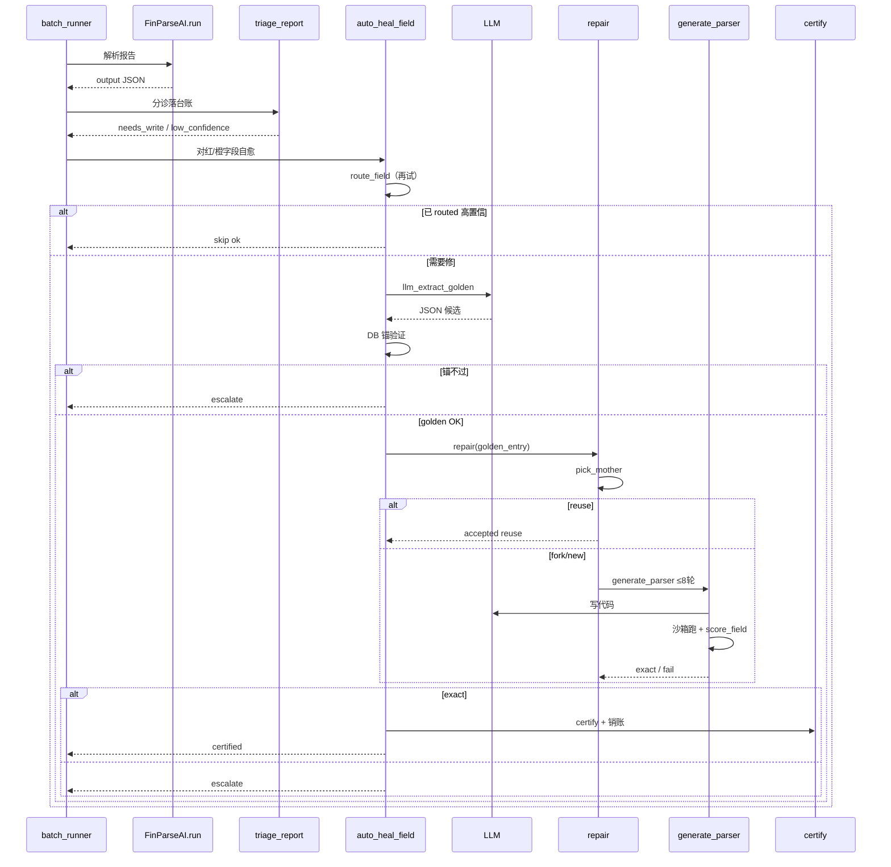

# 图 5：构建期自愈闭环（详细导读）

> **这篇文档专门讲「有问题时系统怎么自己长出解析器」**。建议先看完 [图 3 route_field](./03-route-field-internals.md) 和 [图 4 分诊队列](./04-triage-queue.md)，再读本篇。

---

## 0. 一句话：自愈在干什么？

运行期解析失败后，系统**不能**随便把错结果入库。构建期自愈的目标是：

> **为「这份版式 + 这个字段」生成或选定一个专用 Python 解析器，且对标准答案（golden）做到 `exact`，然后认证入库——下次同版式自动 `routed`。**

做不到 `exact` → **转人工**，绝不留下半成品解析器。

---

## 1. 什么时候会进入自愈？

自愈不是每次解析都跑，而是**先有「问题」信号**：

| 前置步骤 | 发生了什么 |
|----------|------------|
| `FinParseAI.run()` | 运行期解析（路由 or 冷启动） |
| `triage_report()` | 再单独跑一遍 `route_field`，给每个字段打标签 |

分诊结果（`goldset/triage_queue.json`）：

| 颜色 | `reason` | 含义 | 会不会触发自愈 |
|------|----------|------|----------------|
| 🔴 红 | `needs_write` | 没有任何认证解析器 `clean` | ✅（批处理 `heal=True` 时） |
| 🟠 橙 | `low_confidence` | 路由命中但 DB 锚对不上 | ✅（同上） |
| 🟡 黄 | `unverified` | 硬规则过但无锚可验 | ❌ 批处理默认跳过 |
| 🟢 绿 | `ok` | routed 且高置信 | ❌ 已可信 |

批处理里触发自愈的条件（`batch_runner.py`）：

```python
if heal and r["status"] == "open" and r["reason"] in ("needs_write", "low_confidence"):
    if spec.anchor_key:   # 必须有 DB 锚（营收/成本/研发）
        auto_heal_field(spec, code, year)
```

**注意**：客户/供应商/员工等**无 `anchor_key` 的字段**，自动自愈会直接 `continue` 跳过，只能走人工。

---

## 2. 三条入口（同一条内核，golden 来源不同）

```mermaid
flowchart LR
    subgraph E1["入口 A：批处理自动"]
        B1[batch_runner<br/>heal=True] --> A1[auto_heal_field]
        A1 --> G1[LLM 抽 golden<br/>须过 DB 锚]
    end

    subgraph E2["入口 B：脚本/认证期"]
        B2[heal_field<br/>传入 golden_entry] --> R2[repair 直接修]
    end

    subgraph E3["入口 C：控制台人工"]
        B3[POST /review/golden] --> G3[人确认真值]
        G3 --> B4[POST /review/certify] --> C3[服务端重验 exact]
    end

    G1 --> CORE[repair → generate_parser → certify]
    R2 --> CORE
    C3 --> CORE

    style CORE fill:#422006,stroke:#b45309
```



| 入口 | 函数 / API | golden 从哪来 | 典型场景 |
|------|------------|---------------|----------|
| **A** | `auto_heal_field` | LLM 从原表抽 + **DB 锚验证** | 无人值守批处理试点 |
| **B** | `heal_field(golden_entry=...)` | 人提前写入 `revenue_golden.json` 或脚本构造 | 认证期、有标准答案的修复 |
| **C** | `/review/golden` + `/review/certify` | 人在控制台核对 PDF 后填写 | 最权威、最常用闭环 |

三条路最终都汇聚到 **`repair` →（可能）`generate_parser` → `certify`**，区别只是**谁先提供可信的 golden**。

---

## 3. 主流程图（总览）

```mermaid
flowchart TD
    START([字段解不干净<br/>needs_write / low_confidence]) --> H1{route_field<br/>已 routed 且高置信?}
    H1 -->|是| SKIP[跳过，已 OK<br/>action=routed]
    H1 -->|否| G{有可信 golden?}

    G -->|否| ESC1[🙋 escalate 转人工<br/>reason: 无golden / LLM抽golden未过锚]
    G -->|是| REP[repair 三岔<br/>pick_mother 选母本]

    REP --> R1{母本 score ≥ 0.999?}
    R1 -->|是| REUSE[reuse 复用母本<br/>不调 LLM]
    R1 -->|否| R2{母本 score ≥ 0.3?}
    R2 -->|是| FORK[fork: LLM 在母本源码上改]
    R2 -->|否| NEW[new: LLM 从零写]

    FORK & NEW --> GEN[generate_parser<br/>最多 8 轮]
    GEN --> LOOP[写代码 → 沙箱跑 → score_field vs golden]
    LOOP --> EX{exact?<br/>score≥0.999 且无 mismatches}
    EX -->|否| FB[_feedback 结构化反馈]
    FB --> LOOP
    EX -->|是| CERT[certify 认证入目录<br/>+ fingerprint]
    EX -->|8轮仍不 exact| ESC2[🙋 转人工<br/>删孤儿 .py 文件]

    REUSE --> DONE1[status=ok]
    CERT --> DONE2[status=certified<br/>triage 销账]
    CERT -.->|route_set 写缓存| NEXT[下次同版式 routed ✅]

    style GEN fill:#422006,stroke:#b45309
    style CERT fill:#14532d,stroke:#22c55e
    style ESC1 fill:#451a1a
    style ESC2 fill:#451a1a
```



---

## 4. 逐步详解：`heal_field`（入口 B，最「标准」的自愈管线）

文件：`src/agents/heal_pipeline.py`

### 步骤 ① 再试一次路由

```python
route = route_field(spec, code, year)
```

即使运行期冷启动失败，构建期仍先问：**认证目录里有没有解析器现在能解干净？**

- `route["status"] == "routed"` 且 `confidence != "low"` → **直接成功**
  - 返回：`action="routed"`, `status="ok"`
  - 调用 `triage_resolve()` **销账**（该字段从待办变 resolved）
- 已 routed 但低置信 → **不销账**，继续往下（或走修复）

**设计意图**：可能运行期走的是冷启动，但专用解析器其实能解；不必白写代码。

### 步骤 ② 检查 golden

```python
if golden_entry is None:
    return {..., "action": "escalate", "status": "needs_human",
            "reason": "no_certified_fit_no_golden"}
```

| 情况 | 含义 |
|------|------|
| `golden_entry is None` | **运行期模式**：没有标准答案，不敢自动写/认证解析器 |
| `golden_entry` 有值 | **认证期模式**：可以驱动 `repair` |

`golden_entry` 结构示例：

```json
{
  "stock_code": "000425",
  "year": 2024,
  "_status": "confirmed_by_human",
  "revenue_breakdown": { "industries": [...], "segments": [...] }
}
```

- `_status` 必须以 `confirmed` 开头，`eval_version` 才会当真值
- 字段名由 `spec.field` 决定（如 `revenue_breakdown`、`rnd_info`）

### 步骤 ③ 调用 `repair`

```python
out_path = f"src/parsers/versions/{spec.version_prefix}_{code}_{year}.py"
r = repair(code, year, golden_entry, lambda c, y: None, out_path, spec=spec)
```

产出文件示例：`src/parsers/versions/revenue_000425_2024.py`

### 步骤 ④ 根据 `repair` 结果分支

| `r` 内容 | 含义 | `heal_field` 返回 |
|----------|------|-------------------|
| `accepted=True`, `action="reuse"` | 已有母本对本报告 exact | `status="ok"`, 不新认证 |
| `accepted=True`, `action="fork"/"new"` | 新写出 exact 解析器 | `certify()` → `status="certified"` |
| `accepted=False` | 8 轮仍不 exact | `status="needs_human"`, `action="escalate"` |

认证时写入：

```python
certify(key, path, field=spec.field, fingerprints=[fingerprint_of(code, year)])
triage_resolve(code, year, spec.field)  # 销账
```

---

## 5. 逐步详解：`auto_heal_field`（入口 A，批处理自动）

文件：`src/agents/auto_heal.py`

与 `heal_field` 的差异：**自己造 golden**，不依赖人先写 `revenue_golden.json`。

### 5.1 路由快跳

```python
rt = route_field(spec, code, year)
if rt["status"] == "routed" and confidence != "low":
    return {"action": "routed", "status": "ok"}
```

### 5.2 `llm_extract_golden` — 自动抽标准答案

**前置条件**（任一不满足 → 返回 `None` → 转人工）：

1. `spec.anchor_key` 存在（营收/成本/研发有 DB 锚；客户/供应商没有）
2. `get_tables(code, year)` 有抽表缓存
3. LLM 从候选表抽出的 JSON **过 DB 锚验证** → `confidence == "high"`

流程：

```
filter_by_signature 找候选表（最多 2 张）
    → LLM 按准则口径抽 JSON（注意单位换算：千元/万元 → 元）
    → field_plausibility(spec, val, anchors)
    → 若锚不过但表是千元/万元 → _scale_amounts ×ratio 再试（单位兜底）
    → confidence == "high" 才返回 golden
```

**关键安全设计**：LLM 抽的值不能盲信，必须 **分项和 ≈ DB 里的营业收入/成本/研发** 才算可信 golden。抽不出 → `reason: "LLM抽golden未过锚"`。

### 5.3 构造 `golden_entry` 并 `repair`

```python
golden_entry = {
    "stock_code": code, "year": year,
    "_status": "confirmed_auto",   # 自动确认，eval_version 会收
    spec.field: golden
}
r = repair(...)
```

### 5.4 成功 vs 失败

| 结果 | 行为 |
|------|------|
| `r["accepted"]` | `certify` + `resolve` + `record_ok`（记为绿） |
| 失败 | **删除** `out_path` 孤儿文件（没认证的不留） |

---

## 6. 逐步详解：`repair` 三岔决策

文件：`src/agents/code_generator.py:189`

```python
mpath, mscore, mkey = pick_mother(code, year, golden_entry[spec.field], catalog, spec)
```

### `pick_mother` 做什么？

在 `goldset/certified_parsers.json` 里，找**同字段**的所有已认证解析器：

1. 逐个在 `tables_cache` 上跑 `version_parse_fn(path)(code, year)`
2. 用 `score_field(spec, 输出, golden)` 打分
3. 返回得分最高的 `(path, score, key)`

这是**构建期**的「选择即验证」——用 golden 打分选母本（不同于运行期用硬规则）。

### 三岔阈值

| 条件 | 动作 | 是否调 LLM | `action` |
|------|------|------------|----------|
| `mscore >= 0.999` | 母本已 exact，直接用 | ❌ | `reuse` |
| `0.3 <= mscore < 0.999` 且有母本 | 把母本源码塞进 prompt 让 LLM 改 | ✅ fork | `fork` |
| `mscore < 0.3` 或无母本 | 从零写 | ✅ new | `new` |

**fork 优先的价值**：相似版式的母本已经解决了 70% 问题，LLM 只改差异，常 1 轮到 exact；弱模型从零写容易卡住。

---

## 7. 逐步详解：`generate_parser` LLM 写码循环

文件：`src/agents/code_generator.py:120`

这是自愈里**最耗时、最核心**的一步（fork 和 new 都会进这里；reuse 跳过）。

### 7.1 第一轮 prompt 里有什么？

| 组件 | 来源 | 作用 |
|------|------|------|
| `_build_contract(spec)` | 准则第 2 号口径 | 告诉 LLM 函数签名、返回结构、认表认列规则 |
| `_render_candidates(tables)` | 候选表前 3 张预览 | 了解表结构（**不给 golden 数值**） |
| `failure` 说明 | 固定文案 | 现有解析器在这份报告上失败 |
| 母本源码（fork 时） | `mother_path` 文件 | 在相似代码基础上改 |

### 7.2 每一轮做什么？

```
for r in 1..8:
    1. chat(role="codegen") → LLM 出 Python
    2. 写入 out_path
    3. version_parse_fn(out_path)(code, year)  # 沙箱 import 执行
    4. eval_version(fn, [golden_entry], spec)  # 对 golden 打分
    5. exact? → accepted=True，退出
    6. 运行报错? → 把 traceback 喂回 LLM，continue
    7. 分数不够? → _feedback(rep, out_rb) 喂回 LLM，继续下一轮
```

### 7.3 什么叫 `exact`？

`src/eval/revenue_score.py`：

```python
exact = (score >= 0.999 and not mismatches)
```

必须**几乎完全一致**，且**没有任何 mismatch 条目**。「差不多」不收。

### 7.4 `_feedback` 为什么不泄露 golden？

防止 LLM 硬编码：

```python
if code == "000425":
    return {...}  # 作弊
```

反馈只给：得分、哪些维度/行有问题（issue 类型）、空输出时的常见坑。**不给标准答案的具体数值**。

### 7.5 8 轮仍失败

```python
return {"accepted": False, "escalate": "human", "best_score": score, ...}
```

`auto_heal` 会删掉未认证的 `out_path` 文件。

---

## 8. 逐步详解：`certify` 认证入库（闭环闭合）

文件：`src/eval/parser_catalog.py`

```python
certify(key, path, field=spec.field, fingerprints=[fp])
```

写入 `goldset/certified_parsers.json`：

```json
{
  "key": "000425-2024-revenue_breakdown-认证",
  "path": "src/parsers/versions/revenue_000425_2024.py",
  "field": "revenue_breakdown",
  "fingerprints": ["fp_abc123..."]
}
```

同时（在 `route_field` 路由成功时还会）：

- `route_set(field, fingerprint, path)` → `goldset/route_cache.json`
- `tag_fingerprint(path, fp)` → 母本清单里补指纹

**下次**同版式报告进来：

```
fingerprint_of(code, year) → route_get → 只跑那一个解析器 → clean → routed ✅
```

这就是自愈的**闭环**：今天修的解析器，明天同版式自动命中。

---

## 9. 入口 C：控制台人工路径（不走 `heal_field`）

文件：`src/console_service.py` + `src/api.py`

人工路径**不经过** `heal_field`，但语义一致：

```
1. POST /review/golden
   → save_golden() 写入 goldset/revenue_golden.json

2. 人在前端改解析器代码

3. POST /review/certify  (body: code_src)
   → recode(): 在缓存表上跑人改的代码，对 golden 重验 exact
   → exact 才写入 versions/*.py + certify()
```

**服务端不信前端声明的 exact**，必须自己重跑打分（正确率优先）。

---

## 10. 所有可能的返回结果（对照表）

### `heal_field` 返回字段

| `status` | `action` | 含义 |
|----------|----------|------|
| `ok` | `routed` | 路由已命中，无需修 |
| `ok` | `reuse` | 母本 exact，复用 |
| `certified` | `fork` / `new` | 新解析器 exact 并认证 |
| `needs_human` | `escalate` | 无 golden / 修不到 exact |

### `auto_heal_field` 额外 `reason`

| `reason` | 含义 |
|----------|------|
| `LLM抽golden未过锚` | 抽不出可信标准答案 |
| `LLM写解析器未到exact(最好0.xx)` | golden 有了但代码写不出来 |
| `自愈异常: ...` | repair 过程抛错 |

---

## 11. 自愈会读写哪些文件？

| 文件 | 读 | 写 |
|------|----|----|
| `goldset/tables_cache/{code}_{year}.json` | ✅ 跑解析器输入 | — |
| `goldset/certified_parsers.json` | pick_mother / candidates_for | certify |
| `goldset/route_cache.json` | route_field | route_set（路由成功后） |
| `goldset/revenue_golden.json` | eval_version 打分 | save_golden（人工） |
| `goldset/triage_queue.json` | — | resolve / record_ok |
| `src/parsers/versions/{prefix}_{code}_{year}.py` | fork 时读母本 | generate_parser 写入 |

---

## 12. 时序图：批处理 `heal=True` 完整一次



---

## 13. 和运行期的边界（面试常问）

| | 运行期 | 构建期（自愈） |
|--|--------|----------------|
| **是否调 LLM** | ❌ 零 LLM | ✅ 抽 golden + 写代码 |
| **判对错依据** | 硬规则 `field_plausibility` | golden `score_field` → `exact` |
| **产出** | JSON 字段值 | 新的 `versions/*.py` + 认证清单 |
| **失败处理** | 不写库 / 送审 | 转人工，删孤儿代码 |
| **谁触发** | 每次 `run()` | 分诊红橙 + `heal=True` 或人工 |

**哲学**：把不确定性（LLM）关在构建期；运行期只跑冻结、可审计的 Python。

---

## 14. 相关代码索引

| 模块 | 职责 |
|------|------|
| `src/agents/heal_pipeline.py` | `heal_field` 标准管线（路由→修复→认证→转人工） |
| `src/agents/auto_heal.py` | `auto_heal_field` + `llm_extract_golden` |
| `src/agents/code_generator.py` | `repair` 三岔 + `generate_parser` 循环 |
| `src/eval/parser_catalog.py` | `pick_mother` / `certify` / `candidates_for` |
| `src/eval/revenue_score.py` | `score_field` / `exact` 判定 |
| `src/eval/run_eval.py` | `eval_version` 跑 golden 打分 |
| `src/eval/sandbox_exec.py` | `version_parse_fn` 沙箱执行 |
| `src/console_service.py` | 人工 `save_golden` / `certify_parser` |
| `src/batch_runner.py:179-192` | 批处理触发自愈的入口 |

---

## 15. 读完后自测三问

1. **为什么没有 golden 就不能自动认证？** — 没有客观标准答案，无法判 `exact`，怕把错解析器固化进目录。
2. **`reuse` 和 `certified` 有什么区别？** — reuse 是已有母本 exact 直接用，不必新写文件；certified 是 fork/new 生成了新解析器并入库。
3. **自愈成功后，下一份同版式报告还要走 LLM 吗？** — 不用。`certify` + `route_cache` 后，运行期 `route_field` 缓存快路径直接 `routed`。
