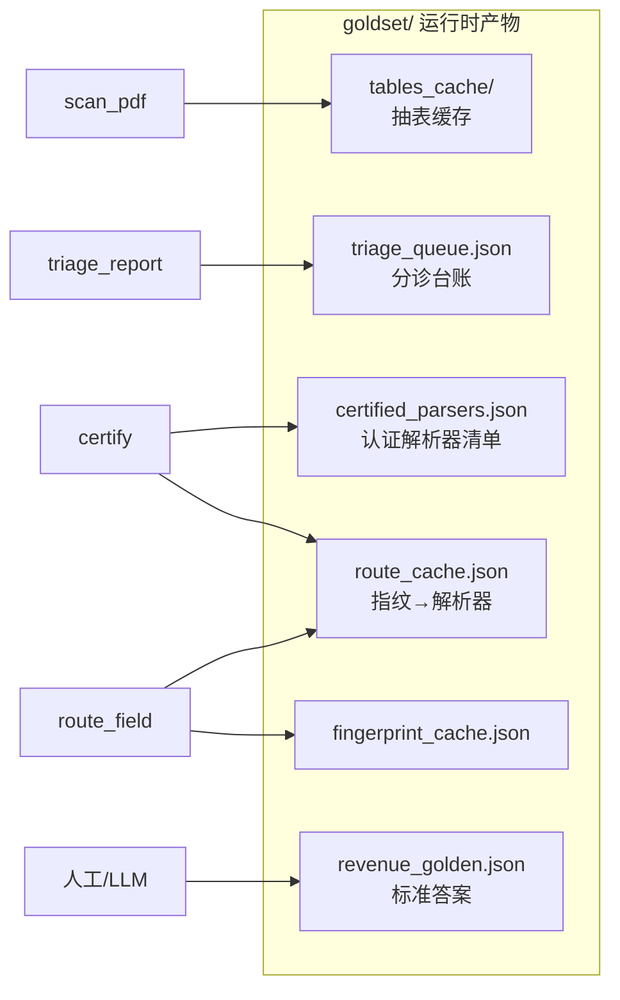

# 图 6：持久状态文件（数据存在哪）

运行时产物均在 `goldset/`（通常 gitignore）。

| 文件 | 写入时机 | 读取时机 |
|------|----------|----------|
| `tables_cache/{code}_{year}.json` | `scan_pdf` / `cache_put` | `route_field`、`repair`、LLM 抽 golden |
| `triage_queue.json` | `triage_report` | 控制台待办、覆盖率统计 |
| `certified_parsers.json` | `certify` | `candidates_for`、`pick_mother` |
| `route_cache.json` | `route_set`（路由成功） | `route_get`（快路径） |
| `fingerprint_cache.json` | `fingerprint_of` | 版式指纹计算 |
| `revenue_golden.json` | 人工 `/review/golden`、自动自愈 | `eval_version`、`score_field` |

**专用解析器源码**：`src/parsers/versions/*.py`（认证后由 `certify` 登记路径）
