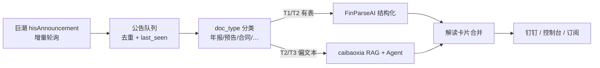

# 第二期规划 — 字段扩展 + 公告自动解读

> **目的**：在现有 6 字段基础上，规划下一期高价值、可落地的目标——包含 **年报附注字段扩展** 与 **全公告监听 → 自动解读** 两条线。  
> **依据**：《公开发行证券的公司信息披露内容与格式准则第2号（2025版）》、`docs/规范要点-解析映射.md`、行业数据链实践。  
> **原则**：不重复 Wind/DB 主表；主攻 MD&A + 附注里 **版式碎、数据商贵、分析师常用** 的字段；每个新字段 = 一个 `FieldSpec` 插件。  
> **产品愿景**：FinParseAI 当前 MVP 是 **年报结构化**；下一期向 **「自选股票 · 公告自动监听 · 自动解读推送」** 演进——机器层（扫表 / 路由 / heal / 认证）复用，业务层按 **公告类型** 挂不同字段集与解读策略。

---

## 一、当前基线（第一期）

| 字段 | `FieldSpec` | 状态 | 说明 |
|------|-------------|------|------|
| 营收构成 | `REVENUE` | ✅ 在做 | 行业/产品/地区/渠道；准则要求四维度含 **销售模式** |
| 成本构成 | `COST` | ✅ 在做 | 按性质（原材料/人工/折旧…）占比 |
| 研发费用科目明细 | `RND` | ✅ 在做 | 附注「研发费用」科目拆分（B 类） |
| 员工 | `EMPLOYEE` | ✅ 在做 | 专业构成 / 教育程度（C 类） |
| 前五大客户 | `TOP_CLIENTS` | ✅ 在做 | 偏明细；D 类，无明细常合规 |
| 前五大供应商 | `TOP_SUPPLIERS` | ✅ 在做 | 同上 |

**不纳入第二期重复建设**：三大报表主表、每股指标等 — 通常已有 DB / Wind / Choice。

**与 caibaoxia 的关系**（第二期产品分层）：

| 层 | 职责 | 典型公告 |
|----|------|----------|
| **FinParseAI** | 可勾稽、可 heal/certify 的 **结构化抽取**（运行期零 LLM） | 年报 / 半年报附注表 |
| **caibaoxia** | **RAG + Agent 模板解读**（运行期可用 LLM） | 业绩预告、重大合同、减持、异动说明等 |
| **公告流水线** | 巨潮增量监听 → 分类 → 分发上下两层 → **钉钉 / 控制台推送** | 自选池全部公告 |

第二期字段可直接注册为 caibaoxia 新 tool；年报类结构化结果作为解读层的 **可信数字底座**，避免纯 LLM 幻觉。

---

## 二、优先级总览

```
轨道 A — 年报附注（FinParseAI Harness，护城河）
  P0  补全/修正（同章节、低成本）       → 先做
  P1  新 FieldSpec（附注表、可勾稽）     → 第二期核心
  P2  文本 + 混合（MD&A 散文）          → 与轨道 B 并行，偏 caibaoxia

轨道 B — 全公告（用户感知主产品，时效性）
  B1  监听 + 分类 + 模板解读 + 推送     → Phase 1 MVP（1～2 周可 demo）
  B2  年报/预告半结构化增强              → Phase 2，接 FinParseAI
  B3  订阅、公告流控制台、溯源           → Phase 3
```

---

## 三、P0 — 补全与口径修正（建议下一期第一批）

仍在 **第三节 MD&A**（收入与成本 / 研发投入），复用现有抽表、路由、控制台。

| # | 数据 | 准则/场景 | 分析价值 | 实现要点 |
|---|------|-----------|----------|----------|
| P0-1 | **客户/供应商 4 项汇总比例** | 第25条 **强制** | 集中度、供应链与关联方风险 | `client_top5_ratio`、`supplier_top5_ratio`、客户/供应商 **关联方占比**；**无明细名单也合规**，应作为主目标 |
| P0-2 | **研发投入「总额三件套」** | 第25条研发投入 | 科创债、硬科技筛选 | 研发投入总额、占营业收入比重、**资本化比重**；与现有「研发费用科目明细」**口径分开** |
| P0-3 | **研发人员** | 同条 | 人力资本强度 | 数量、占员工总数比重、学历/年龄结构（可扩展 `rnd_info` 或新 `rnd_workforce`） |
| P0-4 | **营收 (B) 表：收入+成本+毛利率** | 第25条 ≥10% 分项 | 分产品/行业 **毛利分析** | 与 (A)「占营业收入比重表」区分；判据：**分项收入之和 ≤ 合计**，**禁止**把毛利率当占比、**禁止**占比和≈100 |
| P0-5 | **销售模式维度** | 四维度之一 | 补全营收拼图 | `REVENUE.dims` 含 `by_channel`；加强认表与认证覆盖 |

### P0 推荐实施顺序

1. **P0-1** 汇总比例（补 D 类短板，强制披露）  
2. **P0-2 + P0-3** 研发投入与人员（与现有 `RND` 互补）  
3. **P0-4** 毛利率分项表（认表逻辑与徐工类踩坑修复一体）  
4. **P0-5** 销售模式维度补强  

---

## 四、P1 — 新 FieldSpec（第二期扩展主战场）

附注表版式碎，但有 **合计可勾稽**，适合 A/B/C 判据 + `anchor_key`。

| # | 数据 | 常见位置 | 分析用途 | 建议 cls | 锚点（示例） |
|---|------|----------|----------|----------|--------------|
| P1-1 | **应收账款账龄** | 附注·应收账款 | 回款风险、造假信号 | B：各段之和≈应收余额 | `accounts_receivable` |
| P1-2 | **存货分类** | 附注·存货 | 周期、减值压力 | A 或 B | `inventory` |
| P1-3 | **商誉及减值** | 附注·商誉 | 并购质量、暴雷预警 | B | 商誉相关科目 |
| P1-4 | **关联交易汇总** | 附注·关联方 | 利益输送、定价公允 | B | 营收/成本 |
| P1-5 | **有息负债结构** | 附注·借款 | 信用分析、再融资 | B/C | 负债合计 |
| P1-6 | **前五客户/供应商金额** | MD&A（有则抓） | 供应链图谱 | D | 与 P0-1 比例互验 |

### P1 推荐首批（若 P0 完成后选 1 个附注表）

**P1-1 应收账款账龄** — 信用分析刚需，表结构相对规范。

---

## 五、P2 — 文本与混合（第三期 / caibaoxia）

| 数据 | 形式 | 用途 | 建议做法 |
|------|------|------|----------|
| MD&A 核心结论 | 散文 | 主题、情绪、摘要 | 章节切片 + LLM（运行期可用 LLM） |
| 可能面对的风险 | 专节 | 风险因子库 | 按条切分 + 分类 |
| 分红方案 | 重要事项 | 股息策略 | 强模板，规则为主 |
| 资本开支 / 在建工程叙述 | MD&A + 附注 | 产能周期 | 表 + 段落混合 |
| ESG / 碳排放 | 独立章节 | 新规、机构持仓 | 逐年变重要 |

**说明**：不必全部走「一版式一 parser」；可与 caibaoxia RAG 并行。

---

## 六、按「谁愿意付钱」的价值地图

| 用户场景 | 高价值字段 |
|----------|------------|
| 量化 / 选股 | 毛利率分产品、研发强度、客户集中度、应收账龄 |
| 信用 / 风控 | 负债结构、商誉减值、关联交易、客户集中度 |
| 供应链 / 产业 | 分产品营收、前五客户/供应商（含金额） |
| 科创 / 主题 | 研发投入总额、资本化率、研发人员 |
| AI 研报 / Agent | MD&A 摘要 + 上述结构化字段 |

---

## 七、下一期若只做 3 个（推荐 MVP）

| 优先级 | 字段 | 理由 |
|--------|------|------|
| **1** | 客户/供应商 **4 项汇总比例** | 准则强制；常无明细也能抓；补现有 D 类 |
| **2** | **研发投入总额 + 资本化率 + 研发人员** | 与 `rnd_info` 互补；科创场景刚需 |
| **3** | **营收 (B) 表：分产品/行业 收入+成本+毛利率** | 毛利分析；与 (A) 表认表逻辑闭环 |

第四候选：**应收账款账龄**（P1 附注表首选）。

---

## 八、接入现有架构的方式

每个新字段仍是一个 `FieldSpec`，机器层（路由 / heal / certify / 沙箱）**不用改**。

```python
# 示例：客户/供应商汇总比例（B 类，扁平 dict）
CLIENT_SUPPLIER_SUMMARY = FieldSpec(
    "client_supplier_summary", "ratio_pct",
    cls="B", label="客户供应商汇总披露",
    total_key="...", detail_key="...",
    spec_note="准则第二十五条强制：前5名客户销售额占比、前5名供应商采购额占比、关联方比例。",
    table_markers=("前五大客户", "前五大供应商", "占年度销售总额比例"),
    section_anchors=("收入与成本", "主要客户", "主要供应商"),
)

# 示例：研发投入总额（B 类）
RND_INVESTMENT = FieldSpec(
    "rnd_investment", "amount",
    cls="B", label="研发投入总额",
    total_key="total", detail_key="items",
    anchor_key="rnd_expense",
    spec_note="准则第二十五条：研发投入总额、占营收比重、资本化比重；与附注研发费用科目明细口径不同。",
    table_markers=("研发投入", "占营业收入比例", "资本化"),
    section_anchors=("研发投入",),
)
```

流程不变：

```
scan_pdf → tables_cache → route_field → plausibility → triage → (heal) → certify
```

---

## 九、不建议第二期做的

| 项目 | 原因 |
|------|------|
| 三大报表主表重复建设 | DB / Wind 已有，ROI 低 |
| 十大股东明细 | 有专门数据源，PDF 版式杂 |
| 审计意见全文 | 偏 NLP，非表格式优势 |
| 一次性上 20 个字段 | golden / 认证库爆炸；**单字段绿覆盖率到 70%+ 再扩** |

---

## 十、验收与指标（第二期 Definition of Done）

每个新字段单独验收，口径与第一期一致：

| 指标 | 目标（待定，填实测） |
|------|----------------------|
| 硬规则 clean 率 | ≥ 70%（首批）→ 79%+（成熟） |
| 有 `anchor_key` 字段 | 开启 `auto_heal`，统计自愈成功率 |
| 无锚字段 | 控制台人审 + 汇总比例优先 |
| golden 条数 | 每字段 ≥ 30 份 confirmed 再批量 heal |

---

## 十一、产品方向 — 从年报到全公告自动解读

### 11.1 定位

- **今天**：人手触发批处理，专吃 **A 股年报 PDF** 附注明细（6 字段 + heal）。
- **下一期**：**自动监听**自选股票在巨潮披露的新公告，**自动输出解读**并推送（钉钉 / 控制台）。
- **边界**：不是用一个解析引擎硬吃所有公告——**结构化走 FinParseAI，语义解读走 caibaoxia**。

### 11.2 价值判断

| 维度 | 只做年报批处理 | 监听 + 自动解读 |
|------|----------------|-----------------|
| 用户感知 | 后台数据生产 | **当晚就知道**（投研助手） |
| 市场叙事 | 垂直深 | 平台大、订阅付费点清晰 |
| 技术壁垒 | 版式长尾 + exact 认证 | 时效流水线 + RAG；结构化仍靠 Harness |

**结论**：全公告解读 **产品想象空间更大**；年报附注结构化 **技术和商业护城河更深**。第二期 **两条轨道并行**，不做非此即彼。

### 11.3 公告分层处理策略

| Tier | 公告类型 | 处理方式 | 是否 exact / heal |
|------|----------|----------|-------------------|
| **T1** | 年报、半年报附注 | FinParseAI `FieldSpec` + 认证解析器 | ✅ |
| **T2** | 业绩预告、业绩快报 | 少量固定字段抽取 + Agent 模板解读 | 部分（关键数字可勾稽时） |
| **T3** | 重大合同、减持、诉讼、回购等 | PDF/正文切片 → RAG → 固定模板摘要 | ❌（体验优先） |

### 11.4 目标流水线



---

## 十二、轨道 B — 公告监听与自动解读（实施规格）

### 12.1 现有基础（可复用）

| 模块 | 路径 | 现状 | 下一期改造 |
|------|------|------|------------|
| 巨潮客户端 | `book-agent/web/cninfo_client.py` | 已接 `hisAnnouncement`，**仅筛年报** | 泛化为增量查询 + 多 `category` |
| **Phase 1 开发提示词** | `book-agent/docs/announcement-watcher-phase1-开发提示词.md` | — | 50 只自选池监听 + FinParseAI 对接规格 |
| PDF 下载 | `book-agent/web/pdf_pipeline.py` | `ensure_annual_pdf` | → `ensure_announcement_pdf(adjunctUrl)` |
| 结构化 | `FinParseAI` `engine_orchestrator` | 6 字段，`report_quarter='annual'` | 抽象 `doc_type`，年报优先 |
| 解读 | `quantification/backend/services/agent.py` + `rag.py` | 财报问答 | 公告模板 prompt + 原文切片 |
| 推送 | `formal/send_to_dingtalk.py` | 已有 webhook | 解读结果格式化推送 |

### 12.2 分阶段落地

#### Phase 1 — 最小闭环（MVP，优先 demo）

- [ ] 自选池（如 10 只 code）每 5 分钟轮询巨潮 **当日新公告**
- [ ] 持久化 `last_seen`（`announcementId` / `announcementTime`）防重复
- [ ] 下载 PDF 或 HTML 正文 → 标题 + 前几页文本
- [ ] caibaoxia Agent：**固定模板解读**（事项摘要、关键数字、同比/预期、利好利空、原文引用）
- [ ] 钉钉 webhook 推送解读卡片
- [ ] **不做**全类型 exact 解析；先证明「监听到 → 读懂 → 推到眼前」

**解读模板字段（示例）**：

```markdown
【{stock_code} {short_name}】{announcement_title}
披露时间：{time} | 类型：{doc_type}

① 事项摘要（1～3 句）
② 关键数字（若有：金额、区间、同比）
③ 影响判断（利好/利空/中性 + 一句理由）
④ 原文依据（引用页码/段落）
```

#### Phase 2 — 结构化增强

- [ ] 标题命中「年度报告」→ 触发 FinParseAI（现有 6 字段 + P0 新字段）
- [ ] 标题命中「业绩预告」→ 新 `FieldSpec`：`earnings_forecast`（净利润区间、变动幅度、变动原因）
- [ ] 解读层合并：Agent 引用 FinParseAI JSON 作为 **数字底座**
- [ ] 季报附注：复用 Harness，`doc_type=interim`，准则与认表规则按类型配置

#### Phase 3 — 产品化

- [ ] 前端：**公告流** + 解读历史 + 点击溯源（接控制台 PDF 高亮）
- [ ] 用户订阅：自选股票列表、公告类型过滤、推送渠道
- [ ] 与 FinParseAI 分诊台打通（结构化字段绿/红状态可点进审核）

### 12.3 代码抽象清单（年报 → 多公告）

第二期实施时需逐步去掉「写死年报」：

| 位置 | 现状 | 改造 |
|------|------|------|
| `engine_orchestrator.py` / `api.py` | `report_quarter='annual'` | 按 `doc_type` 选季度与字段集 |
| `anchors.py` | 锚默认取 annual | 预告/季报用对应 DB 行或禁用锚 |
| `llm_judge.py` / `vector_validator.py` | 集合名 `{code}_{year}_annual` | → `{code}_{doc_id}` 或按类型 |
| `table_scanner.py` | 章节锚「财务报表附注」 | 按 `doc_type` 配置 `section_anchors` |
| `cninfo_client.py` | `category_ndbg_szsh` 仅年报 | 多 category 映射表 + `poll_new_announcements(codes, since_ts)` |

### 12.4 不建议第二期做的（公告侧）

| 项目 | 原因 |
|------|------|
| 全市场实时监听（5000+ 只） | 先自选池验证；注意巨潮频率与封禁 |
| 每条公告都走 heal/certify | ROI 低；T3 类走 RAG 即可 |
| 替代 Wind 公告摘要 | 差异化在 **持仓相关解读 + 结构化附注**，不在泛摘要 |

---

## 十三、相关文档

| 文档 | 路径 |
|------|------|
| 准则 → 解析映射 | `docs/规范要点-解析映射.md` |
| 字段插件定义 | `src/eval/field_spec.py` |
| 批处理全流程 | `docs/批处理到解析完成-全流程详解.md` |
| 自愈闭环 | `docs/flows/05-heal-loop.md` |
| 巨潮客户端 | `book-agent/web/cninfo_client.py` |
| caibaoxia Agent | `quantification/backend/services/agent.py` |
| 钉钉推送 | `formal/send_to_dingtalk.py` |

---

## 十四、任务清单（执行时勾选）

### P0

- [ ] P0-1：`client_supplier_summary` FieldSpec + default parser + 路由
- [ ] P0-2：`rnd_investment` FieldSpec（总额/占比/资本化）
- [ ] P0-3：研发人员结构扩展
- [ ] P0-4：营收 (B) 表 / 毛利率分项（认表 (A)(B) 分离）
- [ ] P0-5：销售模式维度覆盖率与 golden

### P1（可选）

- [ ] P1-1：应收账款账龄
- [ ] P1-2 ~ P1-6：按业务需求排期

### 工程（轨道 A）

- [ ] `engine_orchestrator.run` 注册新字段
- [ ] `triage_report` / 控制台字段列表更新
- [ ] seed golden 脚本支持新字段
- [ ] 更新 `docs/规范要点-解析映射.md` 与面试导读

### 轨道 B — Phase 1（公告监听 MVP）

- [ ] `cninfo_client.poll_new_announcements(codes, since_ts)` 增量查询
- [ ] 公告去重表 / `last_seen` 持久化（`goldset/announcement_cursor.json` 或 DB）
- [ ] `ensure_announcement_pdf` 泛化下载
- [ ] 公告 `doc_type` 规则（标题 + 巨潮 category）
- [ ] caibaoxia：公告解读 prompt 模板 + 调用入口
- [ ] 钉钉推送：解读卡片格式化（复用 `send_to_dingtalk.py`）
- [ ] 定时任务：`cron` 或 `loop` 每 5 分钟跑自选池

### 轨道 B — Phase 2/3

- [ ] `earnings_forecast` FieldSpec（业绩预告结构化）
- [ ] `doc_type` 贯穿 engine / anchors / RAG 集合名
- [ ] 解读层合并 FinParseAI JSON
- [ ] 前端公告流页面（`/console/announcements` 或独立页）
- [ ] 用户订阅与推送偏好

---

## 十五、面试 / 对外一句话

> 我们做 A 股公告流水线：巨潮增量监听自选池，文本类公告走 RAG + Agent 模板解读并推送；年报附注走自研 Harness 结构化 exact 入库，给解读层提供可勾稽数据。FinParseAI 是可信底座，公告 Copilot 是用户主产品。

---

*文档版本：2026-06-26 · 合并字段扩展与公告自动解读规划；随实施更新实测数字。*
